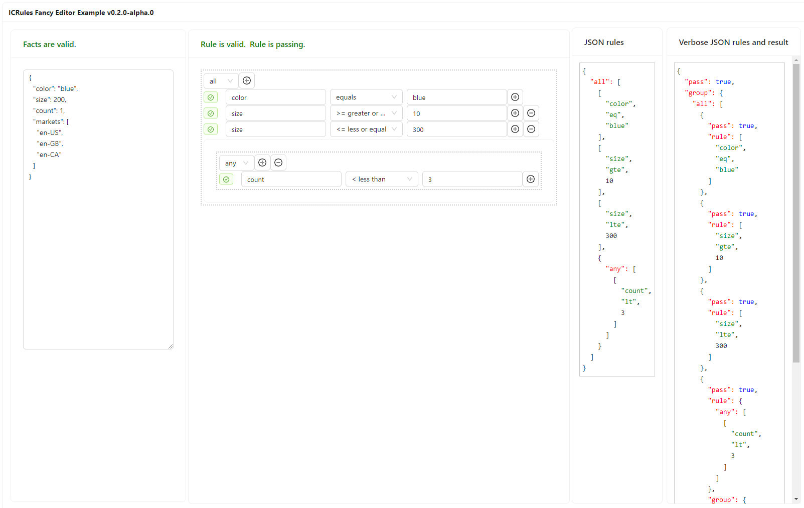

# @icrules/editor

## Reference Rules editor

> *It sure would be nice if we had an interface to modify the rules and then customize facts to tests out our rules.*

I wrote two reference editors, one using plain ol'React and another using the `antd` UI library. 
I'll focus on demonstrating the `antd` based editor library as it brings a better auto-complete among other useful components. 
You can use the editor code as a reference to either write your own, use it directly in your app or just use it on the examples site to generate your rules. 

The editor is data driven by the ICRules Schema and will generate the JSON containing the rules you created along with allowing you to test new facts. Currently the editor is very `alpha phase` as is and is not fully tested.

```ts
import { ICRulesEditorAntd } from '@icrules/editor';

export const RuleEditor = () => {
  const [activeRules, setActiveRules] = useState(rules);
  const onChange = (rules: RuleGroup) => setActiveRules(rules);

  return(
    <ICRulesEditorAntd {...{ facts, rules: activeRules, onChange }} />
  );
}
```

> You can play with the editor right now on the example page (it's very alpha) [examples](https://ineffably.github.io/icrules/)

The `antd` editor looks like this... 



It has the following features:
- Facts editor
- Rule Editor

The JSON you see on the right is not part of the editor, but, the example code and displays 
- the basic JSON schema that the editor is generating.
- the verbose JSON output using the built-in verbose plugin 

## stay tuned, it's not done yet